# Activity #8: Structures, Structure Arrays, and Complex Data Types 

###PROGRAM SCREENSHOTS

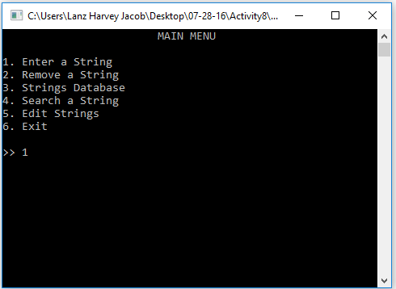
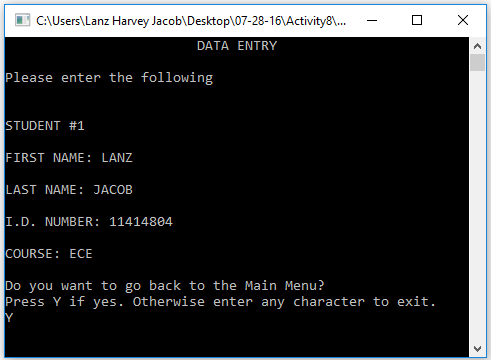
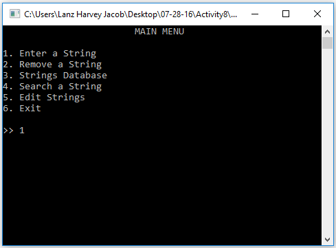
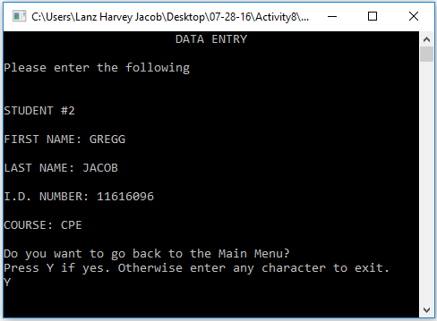
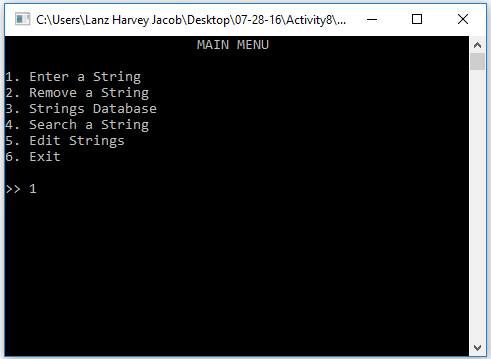
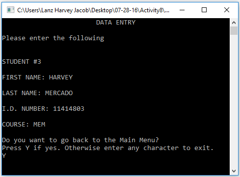
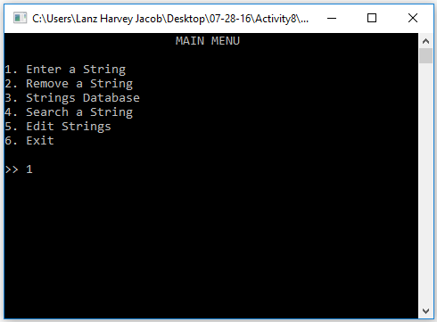
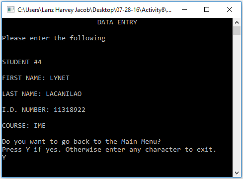
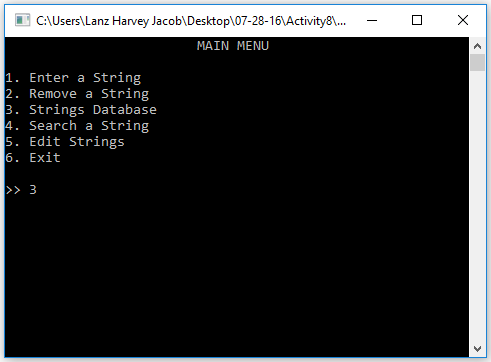
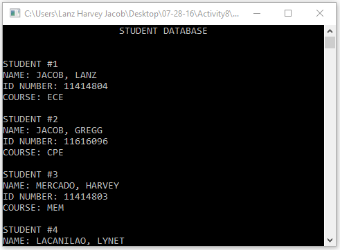
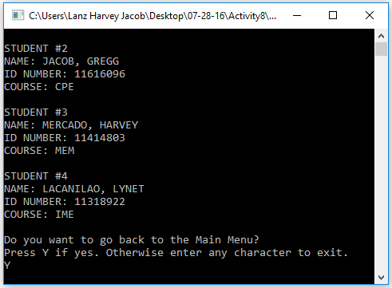

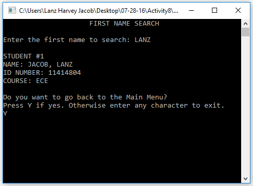

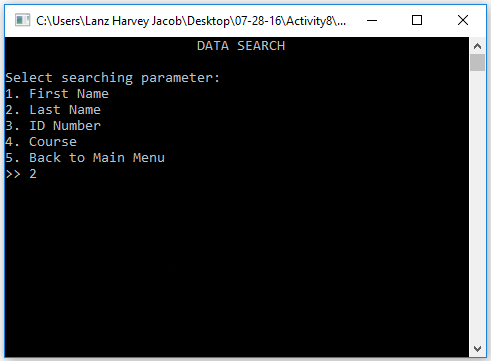
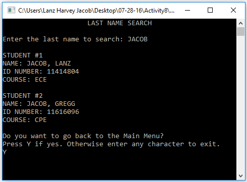
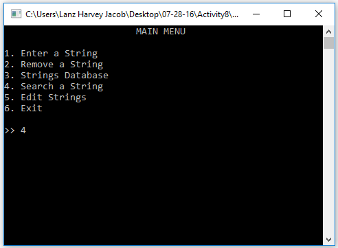
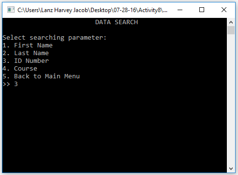
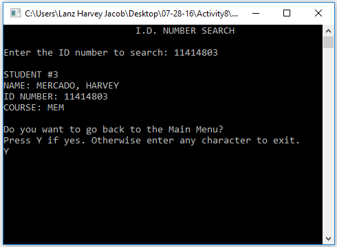
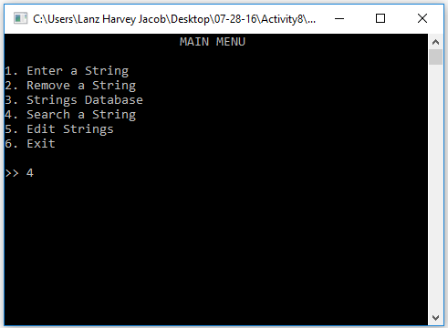
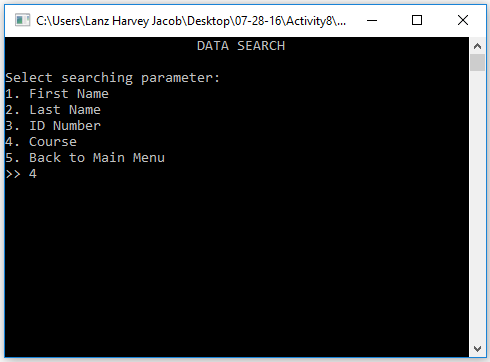
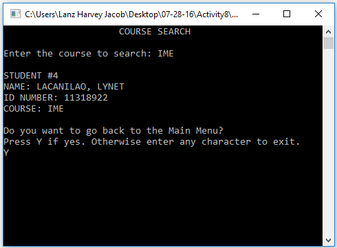

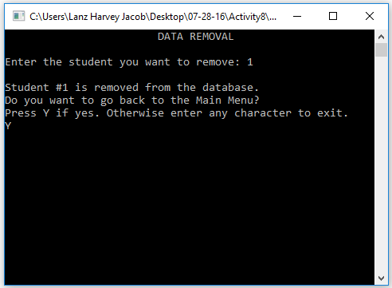

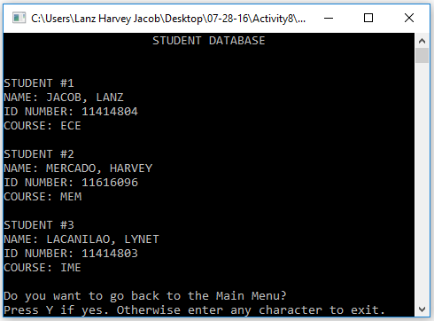
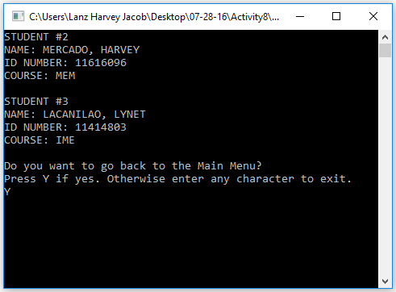
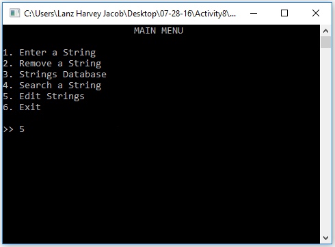
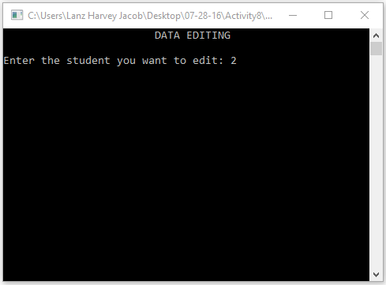
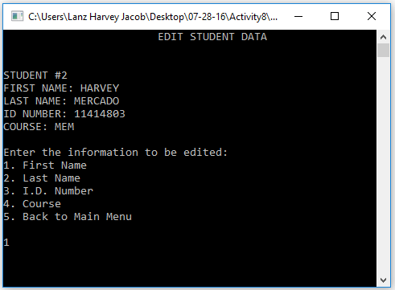
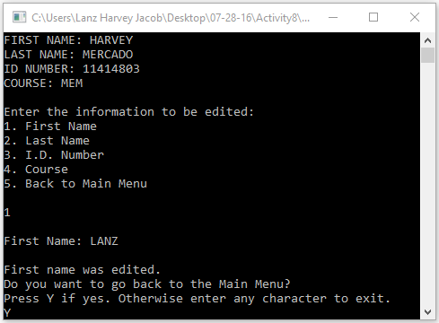
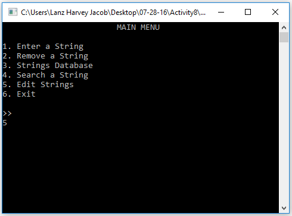
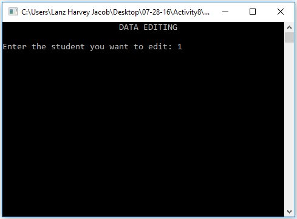
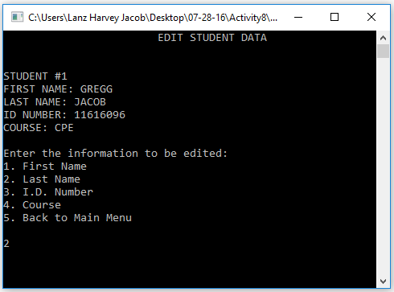
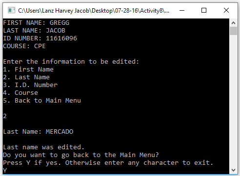
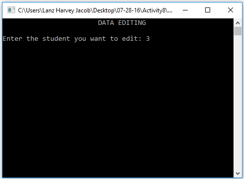
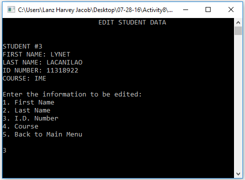
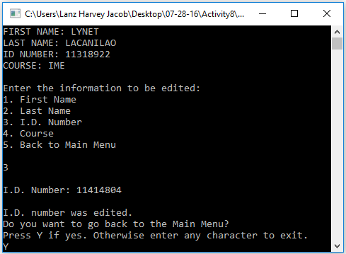

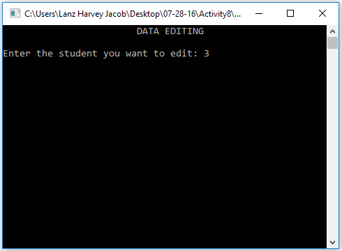
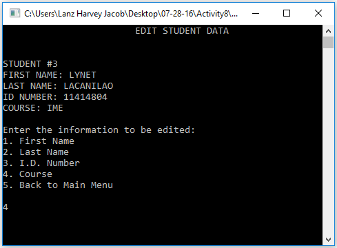
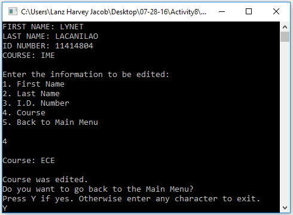
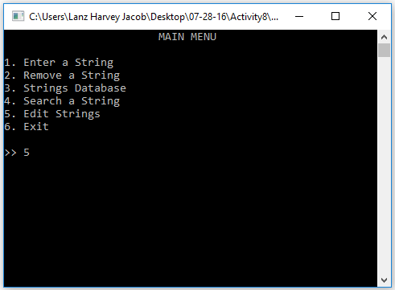
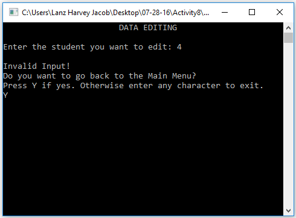

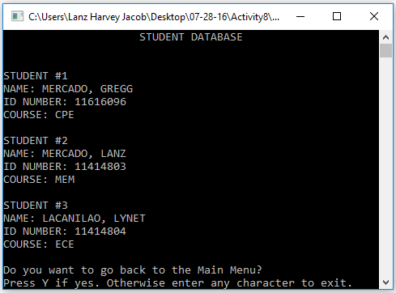
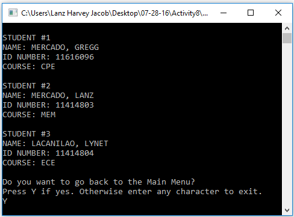
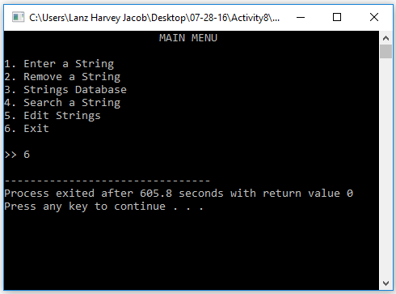

# Activity #5: Strings, String Arrays, and String Manipulation Functions

###PROGRAM SCREENSHOTS
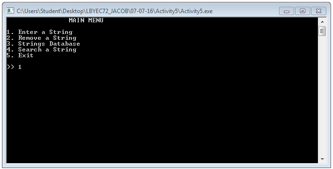

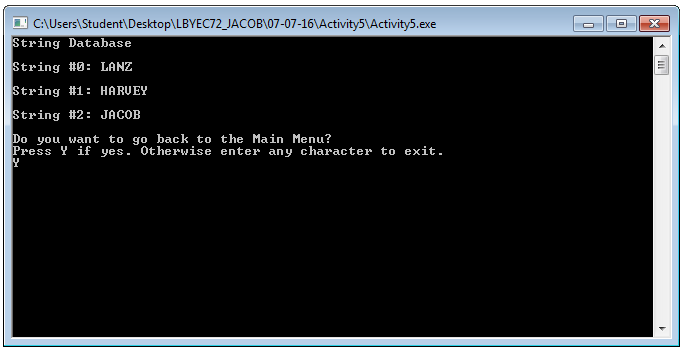

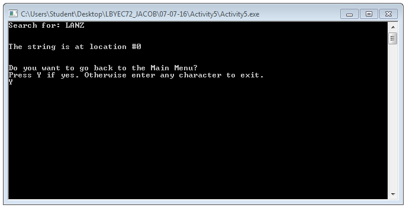
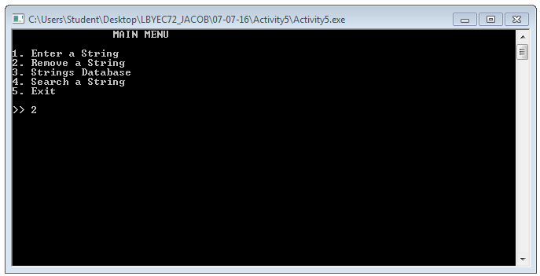
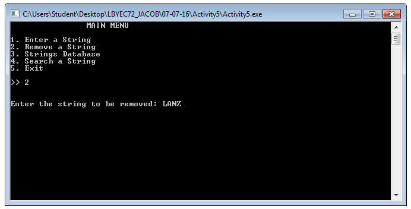
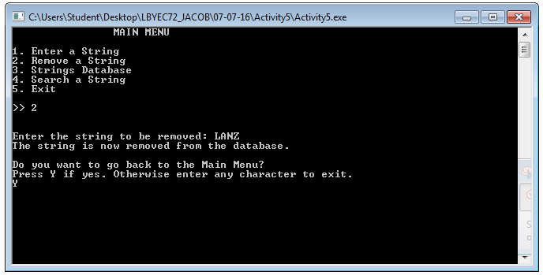
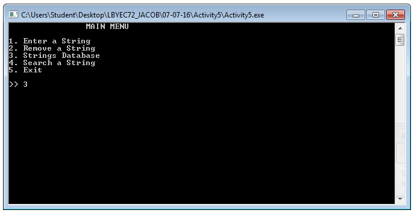
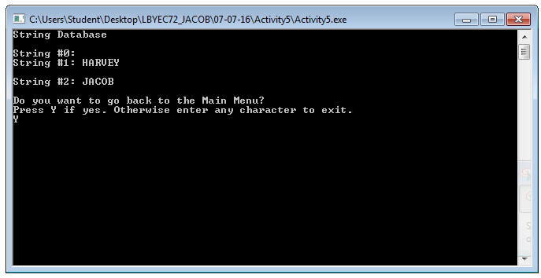

